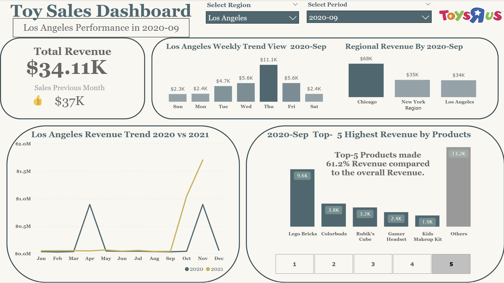
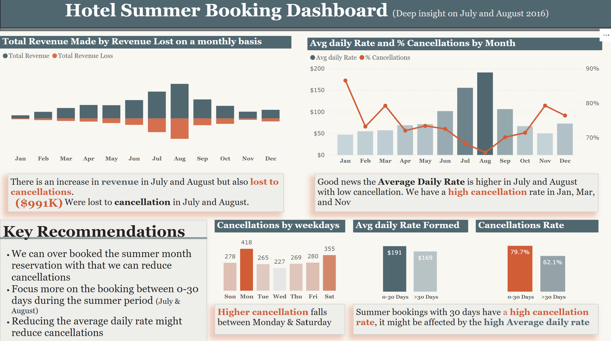

# power_bi_projects
This REPO contains all the Power BI projects I have created and practiced:

1. [HealthCare - Patient Emergency Room Visit Dashboard](Patients_Emergency_Room_Visit_Report)
   
   📊  Analyzed 9,000+ emergency room visits in 2020-2021 to uncover wait time disparities and service gaps across patient demographics and departments.

   

2. [Sales - Toys Sales Trend Report](https://github.com/yuan-116/power_bi_projects/tree/23d254567016a1e83be88c0a4bde272073b924aa/toys_sales)

   📊  Analyzed regional (Los Angeles, New York, Chicago) toy sales trends and product performance in 2020 - 21 by months to uncover revenue concentration and seasonal patterns.

    

4. [Sales - Plant.Co Sales Performance](Plant.co_Sales_Performance)
   
   📊 Analyzed Plant Co.’s sales performance by region, product type, and time to monitor key KPIs, including YTD revenue, PYTD comparison, and gross profit margin.

   

5. [Data Professional Survey Report](https://github.com/yuan-116/power_bi_projects/tree/aea655d5d200694f8c10c8a2a99229b65d061a2c/Data%20Professional%20Survey%20Report)
   
   📊  Analyzed responses from 630 data professionals to uncover entry-level challenges, salary gaps, and top language preferences.
   

6. [Hotel Booking Reservation Report](Hotel_Booking_Reservation_Report)

   📊 Simulated a real-world request from a hotel manager to analyze cancellation rates and generate a data-driven booking performance report with actionable recommendations.

   

7. [Forbes World's Billionaires 2022 Report]()

   📊 Created an interactive dashboard analyzing global billionaire demographics, wealth distribution, and industry concentration based on Forbes 2022 data.

   
   
